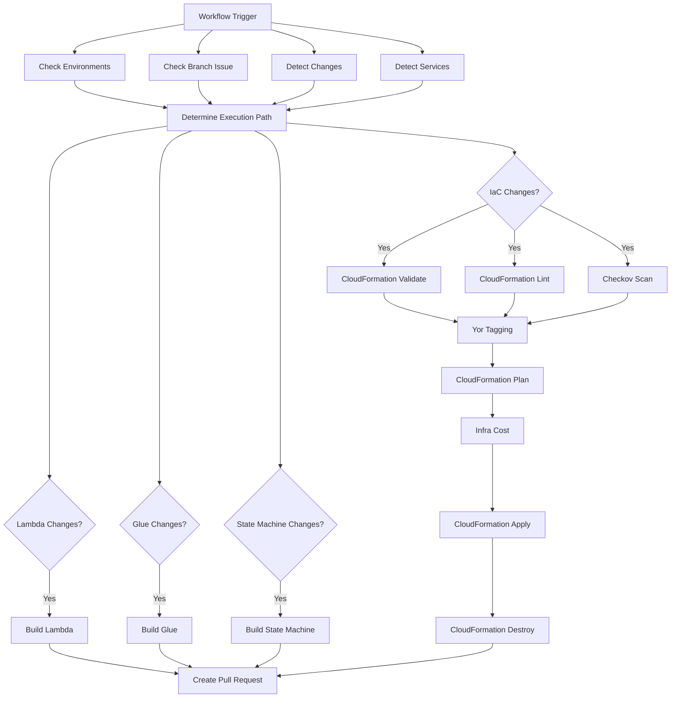

# CloudFormation CI Workflow Design Document

## Overview

The CloudFormation CI workflow is a comprehensive GitHub Actions reusable workflow that provides end-to-end CI/CD capabilities for AWS CloudFormation infrastructure deployments. The workflow mirrors the functionality of a Terraform-based CI pipeline but is specifically designed for CloudFormation templates and AWS-native tooling.

The workflow follows a multi-stage approach with conditional execution based on detected changes and services, ensuring efficient resource utilization while maintaining comprehensive validation and security scanning.

## Architecture

### Workflow Structure

The workflow is organized into the following logical phases:

1. **Discovery Phase**: Environment validation, change detection, and service discovery
2. **Validation Phase**: Template validation, linting, and security scanning  
3. **Build Phase**: Conditional building of Lambda packages, Glue scripts, and other artifacts
4. **Deployment Phase**: Resource tagging, change set creation, cost analysis, and deployment
5. **Cleanup Phase**: Automated resource cleanup for CI environments
6. **Integration Phase**: Pull request creation for successful runs

### Execution Flow



## Components and Interfaces

### Input Parameters

```yaml
inputs:
  environment:
    description: "Environment to deploy to (e.g., ci, devl, test, prod)"
    required: true
    type: string
  cloudformation-dir:
    description: "Directory containing CloudFormation template files"
    required: true
    type: string
    default: "cf"
  cf-params-file:
    description: "CloudFormation parameters file to use"
    required: false
    type: string
    default: "parameters.json"
  ci-pipeline:
    description: "Indicates if this is a CI pipeline run"
    required: false
    type: boolean
    default: true

secrets:
  aws-role-arn:
    description: "AWS role ARN for assuming a role"
    required: true
  infracost-api-key:
    description: "API key for Infracost"
    required: true
  infracost-gist-id:
    description: "Gist ID for Infracost output"
    required: true
```

### Job Dependencies

The workflow uses a dependency graph to ensure proper execution order:

- **Discovery jobs** run in parallel and have no dependencies
- **Validation jobs** depend on execution path determination
- **Build jobs** run conditionally based on detected changes
- **Deployment jobs** depend on successful validation
- **Pull request creation** depends on all previous jobs completing successfully

### External Actions Integration

The workflow integrates with custom GitHub Actions:

- `subhamay-bhattacharyya-gha/check-environments-action`: Environment validation
- `subhamay-bhattacharyya-gha/branch-issue-action`: Branch issue verification
- `subhamay-bhattacharyya-gha/list-updated-files-action`: Change detection
- `subhamay-bhattacharyya-gha/scan-aws-services-action`: Service detection
- `subhamay-bhattacharyya-gha/exec-path-action`: Execution path determination

### CloudFormation-Specific Actions

New actions will be created or existing ones adapted for CloudFormation:

- `cf-validate-action`: CloudFormation template validation
- `cf-lint-action`: CloudFormation linting using cfn-lint
- `cf-plan-action`: CloudFormation change set creation and analysis
- `cf-apply-action`: CloudFormation stack deployment
- `cf-destroy-action`: CloudFormation stack deletion

## Data Models

### Execution Path Model

```json
{
  "IaC": boolean,
  "lambda": boolean,
  "lambda-layer": boolean,
  "glue": boolean,
  "state-machine": boolean
}
```

### Change Detection Model

```json
{
  "files-changed": string[],
  "has-changes": boolean,
  "json-output": string
}
```

### Service Detection Model

```json
{
  "AWS::EC2::Instance": boolean,
  "AWS::S3::Bucket": boolean,
  "AWS::Lambda::Function": boolean,
  "AWS::RDS::DBInstance": boolean,
  // ... other AWS services
}
```

### CloudFormation Change Set Model

```json
{
  "ChangeSetName": string,
  "StackName": string,
  "Changes": [
    {
      "Action": "Add|Modify|Remove",
      "LogicalResourceId": string,
      "ResourceType": string,
      "Replacement": "True|False|Conditional"
    }
  ]
}
```

## Error Handling

### Validation Failures

- **Template Syntax Errors**: Fail fast with detailed CloudFormation validation output
- **Linting Issues**: Report issues but allow soft-fail configuration
- **Security Scan Failures**: Generate SARIF reports and continue with warnings

### Deployment Failures

- **Change Set Creation Failures**: Provide detailed CloudFormation error messages
- **Stack Update Failures**: Report rollback status and failed resources
- **Permission Issues**: Clear guidance on required IAM permissions

### Cleanup Failures

- **Resource Deletion Issues**: Provide manual cleanup instructions
- **Stack Deletion Failures**: Report stuck resources and resolution steps

### Retry Logic

- **AWS API Rate Limiting**: Implement exponential backoff for AWS CLI calls
- **Transient Failures**: Retry CloudFormation operations up to 3 times
- **Network Issues**: Retry artifact uploads and downloads

## Testing Strategy

### Unit Testing

- **Template Validation**: Test CloudFormation template syntax validation
- **Parameter Validation**: Test parameter file parsing and validation
- **Change Detection**: Test file change detection logic
- **Service Detection**: Test AWS service identification in templates

### Integration Testing

- **End-to-End Workflow**: Test complete workflow execution in test environment
- **AWS Integration**: Test actual CloudFormation stack operations
- **Cost Estimation**: Test Infracost integration with CloudFormation
- **Security Scanning**: Test Checkov integration with CloudFormation templates

### Performance Testing

- **Large Template Handling**: Test workflow with complex, large CloudFormation templates
- **Concurrent Execution**: Test workflow behavior with multiple simultaneous runs
- **Resource Cleanup**: Test cleanup performance and reliability

### Security Testing

- **IAM Permission Testing**: Verify minimal required permissions
- **Secret Handling**: Test secure handling of AWS credentials and API keys
- **SARIF Report Generation**: Validate security scan report format and content

## Implementation Considerations

### CloudFormation vs Terraform Differences

1. **State Management**: CloudFormation uses AWS-managed state vs Terraform's S3 backend
2. **Planning**: CloudFormation change sets vs Terraform plan files
3. **Validation**: AWS CloudFormation validate-template vs terraform validate
4. **Linting**: cfn-lint vs tflint
5. **Cost Estimation**: Infracost CloudFormation support vs native Terraform support

### AWS CLI Integration

- Use AWS CLI v2 for all CloudFormation operations
- Configure AWS credentials using OIDC token exchange
- Implement proper error handling for AWS API responses
- Use CloudFormation wait conditions for deployment completion

### Artifact Management

- Store CloudFormation templates and parameters in workflow artifacts
- Cache validation results between jobs
- Upload build artifacts (Lambda packages, etc.) to S3 for deployment
- Maintain deployment logs and change set outputs

### Environment-Specific Configuration

- Support environment-specific parameter files
- Handle environment-specific AWS account/region configuration
- Implement environment-specific resource naming conventions
- Support different deployment strategies per environment (blue/green, rolling, etc.)